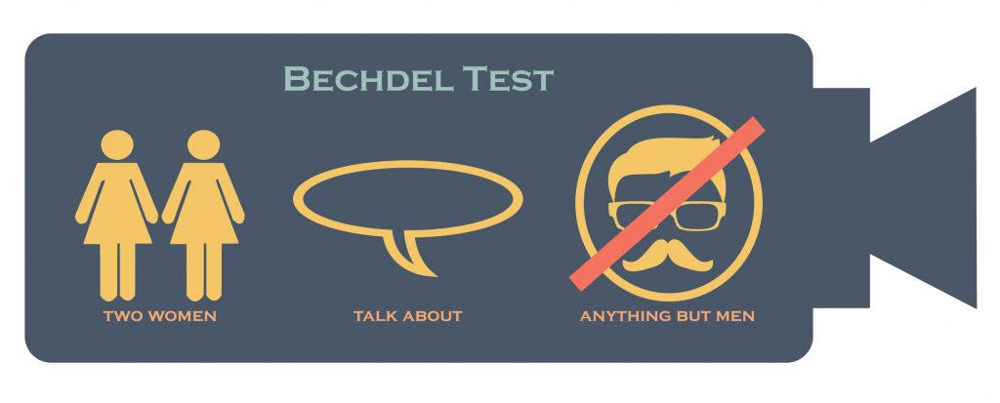

class: center, bottom, inverse

background-image: url(bechdeltestcartoon.jpeg)

background-position: top

# Studies of Bechdel Test 

## HE Qiu, HO Yin Shan, LYU Rui, SI Wen, SUN Weichen

### `r Sys.Date()`

---

```{r setup, include=FALSE}
knitr::opts_chunk$set(echo = FALSE,
                      message = FALSE,
                      warning = FALSE)
library(tidyverse)
library(kableExtra)
library(plotly)
library(leaflet)
library(xaringanExtra)
description <- read_csv("bechdel_data_description.csv")
bechdel_clean <- read_csv("bechdel_clean.csv")
xaringanExtra::use_panelset()
```


```{r}
raw_bechdel <- readr::read_csv('https://raw.githubusercontent.com/rfordatascience/tidytuesday/master/data/2021/2021-03-09/raw_bechdel.csv')
movies <- readr::read_csv('https://raw.githubusercontent.com/rfordatascience/tidytuesday/master/data/2021/2021-03-09/movies.csv')

movies_clean <- movies %>% 
  select(-c(imdb, code, period_code, decade_code, response, type, error, domgross, intgross, budget, released, actors, awards, test, writer, rated, plot)) %>% 
  mutate(year = as.integer(year),
         domgross_2013 = as.numeric(domgross_2013),
         intgross_2013 = as.numeric(intgross_2013)) %>% 
  separate(genre, c("genre1","genre2", "genre3"), sep = ',') %>% 
  separate(director, c("director1","director2", "director3"), sep = ',') %>% 
  separate(language, c("language1","language2", "language3"), sep = ',') %>% 
  separate(country, c("country1","country2", "country3"), sep = ',') %>% 
  separate(runtime, c("runtime", "min"), sep = " ") %>% 
  mutate(runtime = as.numeric(runtime)) %>% 
  select(-min)

factor_cols <- c("binary",
                 "genre1","genre2", "genre3",
                 "director1","director2", "director3", 
                 "language1","language2", "language3",
                 "country1","country2", "country3")

bechdel_clean <- movies_clean %>% 
  mutate_each_(funs(factor(.)), factor_cols)
```

```{css echo = F}
.pull-right{width: 40%;}
.pull-left{width: 60%}
``` 

## Introduction

--
- A technique to evaluate female participation in a movie

--

- Origin from a comic 'Dykes to Watch Out For' (1985)

--

- Named after the cartoonist Alison Bechdel

--

- Reflect gender bias in a movie

--

## Criteria of passing the test
--
 

---


.pull-left[

```{r, message=FALSE}
visdat::vis_dat(bechdel_clean,
                palette = "cb_safe")
```


- Topic from **TidyTuesday**
- Data Source: **GitHub**
- **movies.csv** : 8839 x 5
- **raw_bechdel.csv** : 1794 x 34

]

.pull-right[

### Data Dictionary

```{r}
description %>% 
 kable(align = "c", 
      col.names = c("Variables","Description", "Type")) %>% 
  row_spec(0, color = "white", background = "#277BC0") %>% 
  kable_styling(bootstrap_options = "striped", font_size = 12) %>% 
  scroll_box(width = "100%", height = "500px")
```

]

---

.panelset[

.panel[.panel-name[Overview of the test]

   

  

]

.panel[.panel-name[Analysis]

```{r, out.width="100%"}
color.test <- c(FAIL = '#A93226', PASS = '#237C3A')

 top_movie <- bechdel_clean %>% 
  select(title, imdb_rating, imdb_votes, binary, clean_test, budget_2013, year, metascore) %>% 
  arrange(desc(imdb_rating), desc(imdb_votes)) %>% 
  head(30)

bechdel_imdb_budget <- bechdel_clean %>% 
  select(title, imdb_rating, imdb_votes, binary, clean_test, budget_2013, year, metascore) %>% 
  arrange(imdb_rating, desc(imdb_votes)) %>% 
  head(30) %>% 
  rbind(top_movie) %>% 
  ggplot((aes(year, imdb_rating, 
              color = binary,
              size = budget_2013,
              text = title))) +
  geom_point(position = "jitter")+
    theme_classic() +
    labs(title = "Bechdel test with respect to the IMDB ratings (bubble size = budget)",
       x = "Year",
       y = "IMDB rating")+
  scale_color_manual(values = color.test)

ggplotly(bechdel_imdb_budget) 
```

- First 30 and Last 30 in IMDB ratings were chosen

]
]

---

### The trend of Bechdel Test Results

.panelset[
.panel[.panel-name[By percentage]

```{r, out.width="100%", out.height = "90%"}
color.group <- c(FAIL = '#B44C4B', PASS = '#6C976C')

test_prop <- bechdel_clean %>% 
  mutate(five_year = floor(year/5) * 5) %>% 
  count(five_year, binary) %>% 
  group_by(five_year)%>% 
   mutate(prop = n/sum(n)) %>% 
  ggplot(aes(five_year, prop, fill = binary)) +
  geom_col() +
  geom_hline(yintercept = 0.5, linetype = "dashed", size = 0.5, color = "#004E97")+
  theme_classic() +
  theme(legend.position = "right") +
  labs(x = "Year",
      y = "Proportion") +
  scale_y_continuous(label = scales::percent,
                       breaks = seq(0, 1, by = 0.2))+
  scale_fill_manual(values = color.group) +
  guides(fill=guide_legend(title="Bechdel test")) 

  ggplotly(test_prop)
```


]

.panel[.panel-name[By Number]

```{r out.width="100%", out.height = "90%"}
color <- c(ok = "#95D196", 
           dubious = "#F5B7B1", 
           men = "#F1948A",
           notalk = "#D85C4D",
           nowomen = "#B44C4B")

test_movie <- bechdel_clean %>% 
  group_by(year, clean_test) %>% 
  count() %>% 
  ggplot(aes(year, n, fill = clean_test))+
  geom_area()  +
  theme_classic() +
  theme(legend.position = "bottom") +
  labs(x = "Year",
      y = "Number of movies") +
  guides(fill=guide_legend(title="Test"))+
  scale_fill_manual(values = color)

ggplotly(test_movie)
```

]

.panel[.panel-name[Explanations]


#### Result of the Bechdel test with 5 levels

- **dubious**    
  the topic the conversation between the women in the picture was dubious
    
- **men**    
  the women in the picture only talked about men
  
- **notalk**    
  the women in the picture did not talk to each other
  
- **ok**    
  passed the test
  
- **nowomen**    
  there was less than 2 named women in the picture
  

]
]
---

### Results by regions

.panelset[
.panel[.panel-name[Leaflet]

```{r}
total <- bechdel_clean %>% 
  select(year, title, binary, country1) %>% 
  na.omit() %>% 
  group_by(country1) %>% 
  tally() %>% 
  rename(total = n) %>% 
  ungroup()

pass_rate_country <- bechdel_clean %>% 
  group_by(binary, country1) %>% 
  filter(binary == "PASS") %>% 
  tally() %>% 
  na.omit() %>% 
  left_join(total) %>% 
  filter(total >= 5) %>% 
  mutate(`Passing Rate` = round(100*n/total , digits = 2))
```

```{r}
markers1 <- data.frame(Country = c("Australia", "Canada","France","Germany","Hong Kong","Spain", "UK", "USA" ),
                      description = c("Canberra, Australia: 42.86%", 
                                      "Ottawa, Canada: 47.83%",
                                      "Paris, France: 45.16%",
                                      "Berlin, Germany: 53.85%",
                                      "Hong Kong SAR: 20.00%",
                                      "Madrid, Spain: 60.00%",
                                      "London, UK : 48.30%",
                                      "Washing DC, USA: 43.24%"),
                      latitude = c(-35.282001, 45.424721, 48.864716, 52.520008, 22.302711, 40.416775, 51.509865, 38.889805),
                      longitude = c(149.128998, -75.695000, 2.349014, 13.404954, 114.177216, -3.703790, -0.118092, -77.009056))


markers2 <- data.frame(Country = c("Germany","Spain"),
                      description = c("Berlin, Germany: 53.85%",
                                      "Madrid, Spain: 60.00%"),
                      latitude = c(52.520008,40.416775),
                      longitude = c(13.404954, -3.703790))


icon.red <- makeAwesomeIcon(icon= 'circle', markerColor = 'darkred')
icon.green <- makeAwesomeIcon(icon = 'circle', markerColor = 'darkgreen')

leaflet <- leaflet() %>% 
  addTiles() %>% 
  # addMarkers() %>% 
  addAwesomeMarkers(lng = ~longitude,
        lat = ~latitude,
        popup = ~description,
        data = markers1,
        icon = icon.red) %>% 
  addAwesomeMarkers(lng = ~longitude,
        lat = ~latitude,
        popup = ~description,
        data = markers2,
        icon = icon.green) 
  
f <- paste0("leaflet.html")
htmlwidgets::saveWidget(leaflet, f)
htmltools::tags$iframe(
    src=f,
    width="100%", 
    height="400px",
    scrolling="no", 
    seamless="seamless", 
    frameBorder="0"
  )
```

]

.panel[.panel-name[Analysis]

.pull-left[


#### - Include Regions with >5 data only 

#### - Most of the countries failed the test

#### - Surprisingly, 2/3 Indian movies passed


]

.pull-right[


```{r}
bechdel_clean %>% 
  select(year, title, binary, country1) %>% 
  na.omit() %>% 
  group_by(binary, country1) %>% 
  tally() %>% 
  mutate(binary = as.character(binary)) %>% 
  pivot_wider(names_from = binary,
              values_from = n) %>% 
  na.omit() %>% 
  mutate(RATE = round(PASS*100/(PASS+FAIL),2)) %>% 
  arrange(desc(RATE)) %>% 
 kable(align = "c", 
      col.names = c("Location","FAILURE", "PASS", "PASSING RATE (%)")) %>% 
  row_spec(0, color = "white", background = "#82C5D2") %>% 
  kable_styling(bootstrap_options = "striped", font_size = 14) 

```

]

]
]

---

### By Genre

```{r out.width="100%"}
genre_plot <- movies_clean %>%
  drop_na(genre1) %>% 
  mutate(binary = ifelse(binary == "PASS", 1, 0)) %>% 
  group_by(genre1) %>% 
  summarise(percentage_pass = mean(binary),
            n = n()) %>% 
  ungroup() %>% 
  top_n(10, n) %>% 
  mutate(genre1 = reorder(genre1, percentage_pass)) %>% 
  ggplot(aes(genre1, percentage_pass)) +
  geom_col(fill = "#82C5D2")+ 
   geom_hline(yintercept = 0.5, linetype = "dashed", color = "red4")+
  theme_classic() +
  coord_flip()+
    labs(title = "The Bechdel test passing rate for Top 10 genres",
       subtitle = "Horror pass the Bechdel Test most frequently, while Mystery do so just 23% of the time.",
       caption = "Figure 8",
       x = "Genre",
       y = "Percentage of films that pass the Bechdel Test")+
  scale_y_continuous(label = scales::percent,
                       breaks = seq(0, 0.7, by = 0.1))


ggplotly(genre_plot)
```

- Highest passing rate in Horror movies
- Only horror, drama and comedy genre pass

---

```{r out.width="100%"}
roi <- movies_clean %>% 
  filter(year>1990) %>% 
  mutate(return = (intgross_2013 -  budget_2013)  / budget_2013,
         decade = floor(year/10) * 10) 

roi_plot <- roi %>% 
  group_by(binary, decade) %>% 
  ggplot((aes(binary, 
              log(return),
              fill = binary
              ))) +
  geom_boxplot(aes(text = title)) +
  facet_wrap(~decade, scales = "free") +
  theme_classic() +
  theme(legend.position = "none") +
  labs(title = "Return of investment by the Bechdel test result over decades",
      subtitle = "Decades from 1990 - 2010 with ROI on Bechdel test",
      caption = "Figure 6",
      x = "Bechdel test",
      y = "Log return")+
  scale_fill_manual(values =color.group)

ggplotly(roi_plot, tooltip = "text") 
```


- Boxplot of the return of investment on movies   

- Higher ROI on movies passed the test    

- Movies passed slightly outperformed the failed


